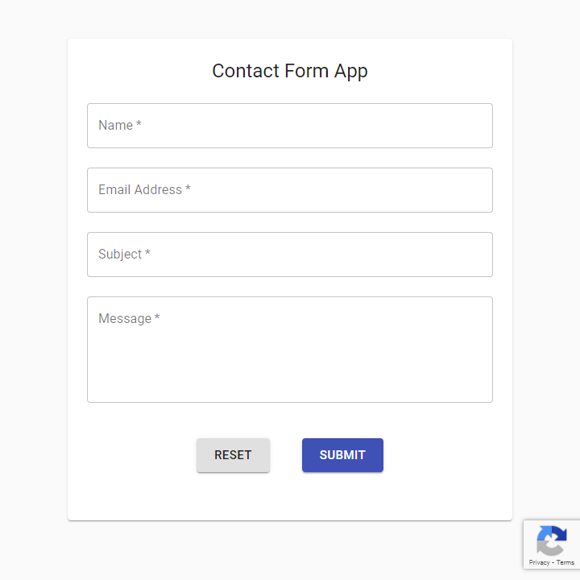

# Contact Form App
 A simple full stack contact form app with reCAPTCHA validation that handles and forwards submitted form data to Gmail account.
 

# Get Started
 1. Open the `.env` file and add your credentials.

 2. In the `client` folder, open the `.env` file to add your reCAPTCHA site key.

 3. Create the front end build with `npm run build`.
 
 4. Begin serving the app with `npm start`.
